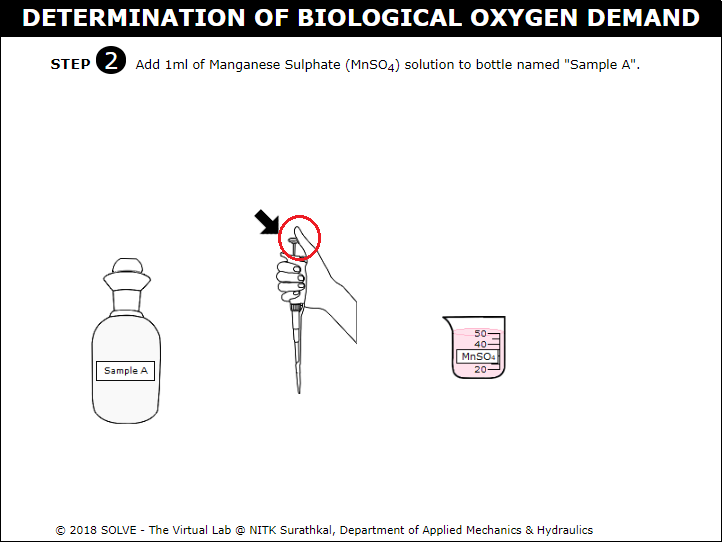

#### These procedure steps will be followed on the simulator

1. When you click on a BOD file, a new window will open as shown below. Go through the solutions and description, then click on the NEXT button at the bottom right corner to move to the next step. 
 

2. Click on the arrow mark and measure the Test Sample to be taken. 
 

3. The measured 200ml Test Sample is taken in two BOD Bottles. 
 

4. Dilute two BOD bottles with 200ml Test Sample by filling distilled water up to the bottle neck and label it as Sample A and Sample B. Select answer to the question displayed and then click Next. 
 

5. Click on automatic pipette to add 1ml of MnSO4 solution to Sample A bottle. 
 

6. Add 1ml of Alkali-iodide-azide solution to Sample A bottle. 
 

7. Again follow the same procedure to add Alkali-iodide-azide solution to Sample A bottle carefully so that there is no bubble formation. Click Next. 
 

8. Mix the solution by shaking BOD bottle upside-down for 25-30 times and allow the precipitate to settle down at bottom.  
 

9. Click on arrow pointer to squeeze the pipette bulb and dip into the H2SO4 solution. 
 

10. Add 1-2ml of conc. H2SO4 carefully without forming air bubbles. Press the up and down arrow on the bulb to take and release the liquid into the BOD bottle. 
 

11. Click on the bottle to shake it by inverting the BOD bottle till all the precipitate dissolves. 
 

12. Take 200ml of sample in a conical flask using pipette. 
 

13. Click on upper and lower arrow to take sample and add it to the flask.  
 

14. Click on funnel to place it in the burette and the burette knob to take Na2S2O3 in the burette. 
 

15. Titrate the solution against 0.025N Na2S2O3. Click on knob to start the liquid running into the conical flask. 
 

16. Add 1ml Starch once the colour of the solution changes to pale yellow, now the colour changes to blue then continue the titration till blue colour becomes colourless. 
 

17. Note down the initial and final burette reading. Click Next. 
 

18. Keep Sample B and put it into the BOD incubator for 5 days. Calibrate the temperature of BOD incubator for approximately 20&deg;C. 
 

19. Set the temperature of incubator to 20&deg;C and wait for 5 days. 
 

20. Repeat step 5 to 16 for Sample B. Note down the Initial and final Burette reading. Determine the BOD of the sample using formula. 
 
